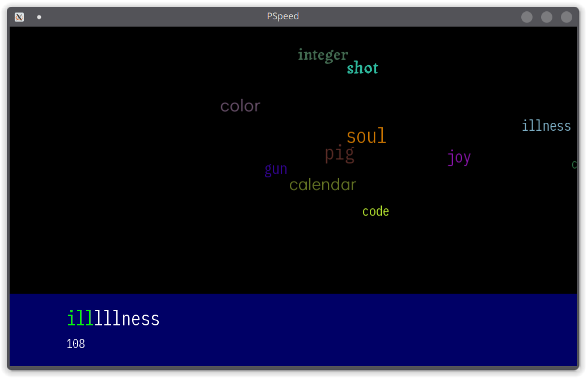
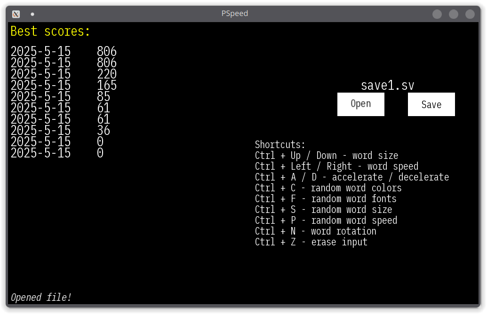

# PSpeed
## What is it
Monkeytyper similiar to the [WSpeed](https://youtu.be/acFO5yQxb6Y) program. Essencially, a monkeytyper where words move from one side of the screen to the other and the user has to type the appearing words to make them disappear. If the user fails to type several words in a row, he loses.

Initially a student project for the C++ course in PJATK.
 
### Screenshots

 

## Various settings
You can customize a lot of aspects of the game:

### Gameplay
- Starting word count
- Starting position of the generated words
- Dispersion - variety of words generated 
- Desired word length
- Randomized word fonts
- Randomized speed
- Randomized word font size
- Word base speed
- Word acceleration
- Word rotation
- Rotation speed
- Allowed number of misses
- Words added per erase

### Technical
- Width and height of the window
- Saving score on exit
- The words source file
- The fonts source folder
- All word-related logic speed

## What's in use
[**SFML 3.0.0**](https://www.sfml-dev.org/) is the backbone of the project, written in **C++** with usage of the C++ 20 standard features. Built using **CMake**.

## Controls
**Enter** - Play 
**Tab** - Pause 

### Shortcuts:
- **Ctrl + Up / Down** - enlarge / shrink words
- **Ctrl + Right / Left** - accelerate / decelerate words
- **Ctrl + A / D** - accelerate / decelerate everything (rotation as well)
- **Ctrl + F** - enable / dsiable random fonts
- **Ctrl + S** - enable / disable random font sizes
- **Ctrl + P** - enable / diable random speed
- **Ctrl + N** - enable / disable word rotation
- **Ctrl + Z** - erase input completely
